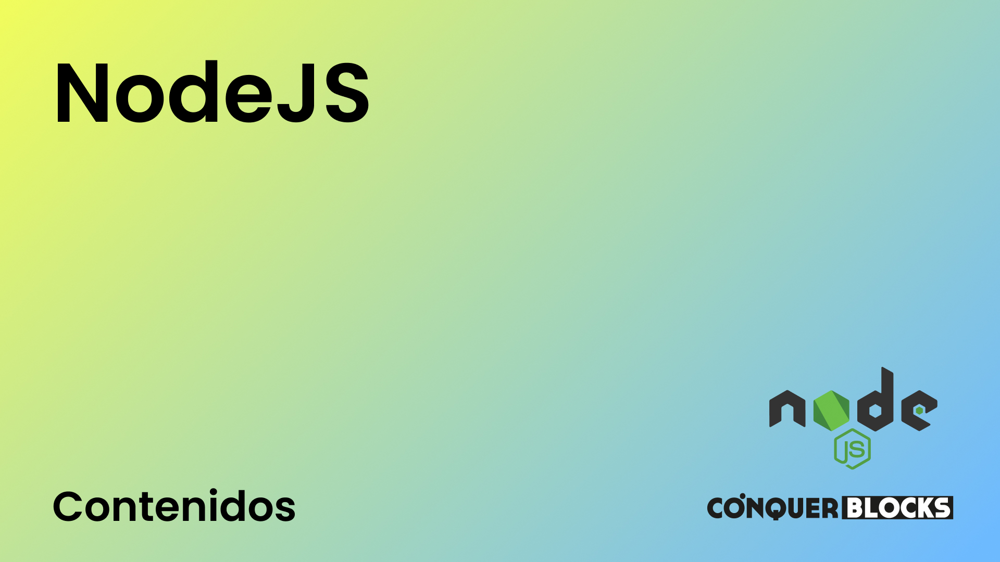

<h1>Máster en Desarrollo FullStack</h1>

<h2>Repositorio creado para el módulo de NodeJS para el Máster de Desarrollo FullStack</h2>

<h4>Material de las clases</h4>
<ul>
    <li><a target="_blank" href="./01_clases/Clase 01 - Introduccion a NodeJS/NodeJS Clase 01 - Introduccion a NodeJS - Diapositivas.pdf">NodeJS Clase 01 - Introducción</a></li>
</ul>
